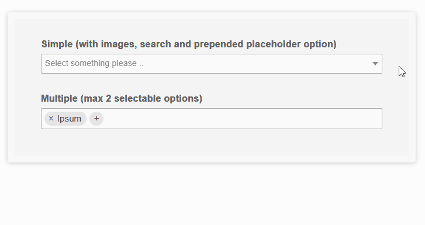

# Superlight vanilla javascript dropdowns by LCweb

Need to **jump off of jQuery (or any other) dependency?** Other packages are too heavy to just tweak select fields?<br/>
LC Select has been created focusing on these aspects: a pure javascript (ES6) plugin offering many features in **just 18KB (+ a 4KB theme)**. 




### Top features list:

- sigle 18KB file, no dependencies, 100% pure javascript
- two themes (light, dark) included. Designed to be themed with no efforts
- themes mix support using prefixed selectors 
- supports both simple and multiple select fields
- fully responsive, fits in any width
- (optional) default placeholder for simple select fields
- (optional) searchbar with minimum fields threshold
- (optional) maximum selectable options
- option images support
- mobile ready
- multilanguage ready


Tested on all mordern browsers *(don't ask for old IE support please)*<br/>
For live demos check: https://lcweb.it/lc-select-javascript-plugin


<br/>


## Installation & Usage

1. include lc_select.min.js

2. include a theme (*eg. themes/light.css*) 

3. initialize plugin targeting one/multiple select fields<br/>**NB:** first parameter may be a textual selector or a DOM object (yes, also jQuery objects)


```
<script type="text/javascript>
new lc_select('select');
</script>
```


<br/>


## Options

Here are listed available options with default values


```
<script type="text/javascript>
new lc_select('select', {

    // (bool) whether to enable fields search
    enable_search : true, 
    
    // (int) minimum options number to show search
    min_for_search : 7,   
    
    // (string) defines the wrapper width: "auto" to leave it up to CSS, "inherit" 
    // to statically copy input field width, or any other CSS sizing 
    wrap_width : 'auto',
    
    // (array) custom classes assigned to the field wrapper (.lcslt-wrap) and 
    // dropdown (#lc-select-dd)
    addit_classes : [], 
    
    // (bool) if true, on simple dropdowns without a selected value, prepend 
    // an empty option using placeholder text
    pre_placeh_opt : false, 
    
    // (int|false) defining maximum selectable options for multi-select
    max_opts : false, 
    
    // (function) triggered every time field value changes. Passes value and 
    // target field object as parameters
    on_change : null, // function(new_value, target_field) {},

    // (array) option used to translate script texts
    labels : [ 
        'search options',
        'add options',
        'Select options ..',
        '.. no matching options ..',
    ],
});
</script>
```


<br/>

## Mixing themes

The easiest and cleanest way to mix themes on the same webpage is 

1. using *addit_classes* option to specify the theme prefix

2. include prefixed themes version (*there are prefixed versions of dark/ligh themes in the "themes" folder*)


```
<link href="themes/light_prefixed.css" rel="stylesheet" type="text/css">
<link href="themes/dark_prefixed.css" rel="stylesheet" type="text/css">

<script type="text/javascript>
new lc_select('.select-class-light', {
    addit_classes : ['lcslt-light']
});

new lc_select('.select-class-dark', {
    addit_classes : ['lcslt-dark']
});
</script>
```


<br/>

## Public Events

Alternatively to the "on_change" option, you can use the native "change" element event to track field changes, 


```
<script type="text/javascript>
document.querySelectorAll('select').forEach(function(el) {

    el.addEventListener('change', ...);
});
</script>
```


<br/>

## Extras

There are two extra events you can trigger on initialized elements:

- **lc-select-refresh:** re-sync select field options and status with plugin instance (eg. when new fields are dynamically added)

- **lc-select-destroy:** remove plugn instance, coming back to HTML select field


```
<script type="text/javascript>
const select = document.querySelector('select');

// initialize
new lc_select(select);

// re-sync
const resyncEvent = new Event('lc-select-refresh');
select.dispatchEvent(resyncEvent);

// destroy
const destroyEvent = new Event('lc-select-destroy');
select.dispatchEvent(destroyEvent);
</script>
```


* * *


Copyright &copy; Luca Montanari - [LCweb](https://lcweb.it)
